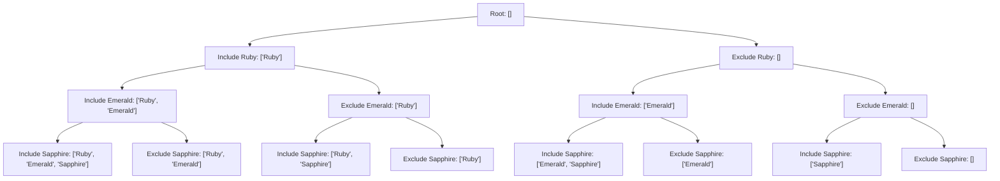

# Day 17: Treasure Chest Combination Generator (Backtracking & Search)

## 💎 Problem Overview

You discovered a magical treasure chest that opens only with the correct combination of gems.
Given a list of gems, the player needs to generate **ALL possible gem combinations** (subsets / power set) that can be carried.

Example gems list:
```python
gems = ["Ruby", "Emerald", "Sapphire"]
```

The algorithm generates all $2^N = 2^3 = 8$ subsets:
- `[]` (Empty Bag)
- `['Ruby']`
- `['Emerald']`
- `['Sapphire']`
- `['Ruby', 'Emerald']`
- `['Ruby', 'Sapphire']`
- `['Emerald', 'Sapphire']`
- `['Ruby', 'Emerald', 'Sapphire']`

---

## ⚙️ How Backtracking Works

Backtracking is a systematic state-space search algorithm that incrementally builds candidate solutions and **backtracks (undoes)** a choice as soon as a branch is fully explored or determined to be invalid.

The 3 core steps of Backtracking:
1. **CHOOSE**: Pick an option at the current state (e.g. include a gem).
2. **EXPLORE**: Recursively navigate deeper down the decision tree (DFS).
3. **BACKTRACK / UNDO**: Revert the choice (`current_bag.pop()`) so alternative branches (e.g. excluding the gem) can be evaluated.

---

## 🌳 Decision & Recursion Tree Diagram

### Mermaid Decision Tree



### ASCII Decision Tree Output

```text
Root: [] (Empty bag)
\-- INCLUDE 'Ruby' -> ['Ruby']
    +-- INCLUDE 'Emerald' -> ['Ruby', 'Emerald']
    |   +-- INCLUDE 'Sapphire' -> ['Ruby', 'Emerald', 'Sapphire']
    |   \-- EXCLUDE 'Sapphire' -> ['Ruby', 'Emerald']
    \-- EXCLUDE 'Emerald' -> ['Ruby']
    |   \-- INCLUDE 'Sapphire' -> ['Ruby', 'Sapphire']
    |   \-- EXCLUDE 'Sapphire' -> ['Ruby']
\-- EXCLUDE 'Ruby' -> []
    \-- INCLUDE 'Emerald' -> ['Emerald']
        +-- INCLUDE 'Sapphire' -> ['Emerald', 'Sapphire']
        \-- EXCLUDE 'Sapphire' -> ['Emerald']
    \-- EXCLUDE 'Emerald' -> []
        \-- INCLUDE 'Sapphire' -> ['Sapphire']
        \-- EXCLUDE 'Sapphire' -> []
```

---

## 📊 Complexity Analysis

- **Time Complexity:** $\mathcal{O}(N \times 2^N)$
  - There are $2^N$ total combinations. Copying each combination of average length $N/2$ into the result set takes $\mathcal{O}(N)$ time per combination.
- **Space Complexity:** $\mathcal{O}(N)$
  - Call stack depth is bounded by $N$ (the number of gems).

---

## 🌍 Real-World Impact of Backtracking

Backtracking is not just for puzzles; it underpins critical industrial algorithms:
- **Scheduling Systems:** Assigning shifts, flights, or university classes while obeying complex constraints.
- **Recommendation Engines:** Evaluating candidate bundles and cross-sell subsets for users.
- **AI Decision Trees & Game AI:** Exploring future game moves (Chess, Go, Sudoku, N-Queens).
- **Combinatorial Routing:** Finding feasible paths in transportation networks subject to stopovers and bag capacities.

---

## 🧪 Running the Code & Unit Tests

### Execute Solution
```bash
python day17_Treasure_Chest_Combination_Generator.py
```

### Execute Unit Tests
```bash
python test_day17.py
```

---

## 🐙 GitHub Repository Setup for Day 17

To push your work for Day 17 to GitHub:

```bash
git add day17_Treasure_Chest_Combination_Generator.py test_day17.py README.md LINKEDIN_REFLECTION.md
git commit -m "Day 17: Implement Treasure Chest Combination Generator using Backtracking"
git push origin main
```

---

## 💼 LinkedIn Reflection

> "Day 17 of my 60-day challenge! Today, I explored **Backtracking & Search** by building a Treasure Chest Combination Generator in Python. Backtracking is a fundamental technique for state-space search—using the **Choose -> Explore -> Undo** loop to generate subsets ($2^N$). Beyond game mechanics, backtracking is the foundation behind AI decision trees, automated flight/shift scheduling, and recommendation systems!"

---

# Day 20: Robot Calculator Arena (Reverse Polish Notation)

## Problem Overview

Two robots send mathematical attacks as Reverse Polish Notation (RPN).
In RPN, every operator comes after its operands, so parentheses are not
needed. For example:

```text
2 1 + 3 *
```

means `(2 + 1) * 3`, which evaluates to `9`.

## Stack Flow

The evaluator processes tokens from left to right:

| Token | Action | Stack |
| --- | --- | --- |
| `2` | Push number | `[2]` |
| `1` | Push number | `[2, 1]` |
| `+` | Pop `1` and `2`, push `3` | `[3]` |
| `3` | Push number | `[3, 3]` |
| `*` | Pop `3` and `3`, push `9` | `[9]` |

For an operator, the first value popped is the right operand. This matters
for subtraction and division: `8 3 -` is `8 - 3`, not `3 - 8`.

The evaluator supports `+`, `-`, `*`, and `/`. Division truncates toward zero,
and malformed expressions or division by zero produce clear exceptions.

## Complexity

- **Time:** $O(n)$, because each token is processed once.
- **Space:** $O(n)$ for the stack in the worst case.

## Run the Day 20 Example

```bash
python day20_Robot_Calculator_Arena.py
```

## Run the Unit Tests

```bash
python -m pytest test_day20.py
```
